# MASLD Pathway Logic

This diagram documents the behavior currently implemented in
`src/pathway.ts` and configured in `src/config.ts`. It is a development
reference, not a clinically validated guideline.

```mermaid
flowchart TD
    START([Start: suspected steatosis]) --> METABOLIC{At least 3 of 5 configured<br/>metabolic syndrome criteria?}

    METABOLIC -- No --> NOT_INDICATED([Exit: MASLD pathway not indicated])
    METABOLIC -- Yes --> ALCOHOL{Alcohol consumption}

    ALCOHOL -- "Male &gt;= 30 drinks/week<br/>Female &gt;= 25 drinks/week" --> ALD([Exit: assess for ALD])
    ALCOHOL -- "Male &gt;= 15 and &lt; 30<br/>Female &gt;= 10 and &lt; 25" --> METALD([Exit: assess for MetALD])
    ALCOHOL -- "Below sex-specific MetALD threshold" --> ALTERNATE{Any configured alternate<br/>diagnosis or cause?}

    ALTERNATE -- Yes --> ALT_EXIT([Exit: assess alternate cause])
    ALTERNATE -- No --> ENZYMES{Aminotransferases pass<br/>configured rule?}

    ENZYMES -- No --> ENZYME_GAP([Stop: further assessment required<br/>recommendation not implemented])
    ENZYMES -- Yes --> DIABETES{Type 2 diabetes?}

    DIABETES -- No --> FIB4[Calculate FIB-4:<br/>age x AST / &#40;platelets x sqrt&#40;ALT&#41;&#41;]
    DIABETES -- Yes --> APP[Calculate APP:<br/>albumin x platelets / 1000]

    FIB4 --> FIB4_LOW{FIB-4 &lt; 1.3?}
    FIB4_LOW -- Yes --> FIB4_2Y([Repeat FIB-4 every 2 years])
    FIB4_LOW -- No --> ELASTOGRAPHY[Perform elastography]

    APP --> APP_LOW{APP &lt;= 5.52?}
    APP_LOW -- Yes --> ELASTOGRAPHY
    APP_LOW -- No --> APP_HIGH{APP &gt;= 9.27?}
    APP_HIGH -- Yes --> APP_1Y([Repeat APP in 1 year])
    APP_HIGH -- No --> APP_GAP([Stop: APP recommendation<br/>not implemented])

    ELASTOGRAPHY --> KPA{kPa &gt;= 8?}
    KPA -- Yes --> REFERRAL([Refer to hepatology])
    KPA -- No --> FIB4_1Y([Repeat FIB-4 in 1 year and intensify<br/>cardiometabolic risk-factor modification])
```

## Branch Criteria

The five metabolic syndrome criteria are:

1. Waist circumference: male `>= 102 cm`; female `>= 88 cm`.
2. Triglycerides: `>= 1.7 mmol/L`.
3. HDL cholesterol: male `< 1.03 mmol/L`; female `< 1.29 mmol/L`.
4. Blood pressure: systolic `>= 130 mmHg`, diastolic `>= 85 mmHg`, or current
   treatment for elevated blood pressure.
5. Fasting glucose: `>= 5.6 mmol/L` or current treatment for elevated glucose.

An alternate diagnosis or cause is any selected configured DILI medication,
positive HBsAg, positive HCV antibody with positive HCV RNA, or selected
configured genetic condition.

The current aminotransferase configuration is `eitherBelow`: continue when ALT
or AST is `< 200 U/L`. If `continueRule` changes to `bothBelow`, both values
must be `< 200 U/L`.

## Prototype Notes

- `src/config.ts` defines `fib4.indeterminateUpperInclusive` as `2.67`, matching the
  source PDF's `1.3-2.67` and `>2.67` branches. The current app routes both
  ranges to elastography, so they are combined in the executable diagram.
- The APP middle range `> 5.52` and `< 9.27` does not have an implemented
  recommendation.
- The recommendation for aminotransferases that do not pass the configured rule
  is not implemented.
